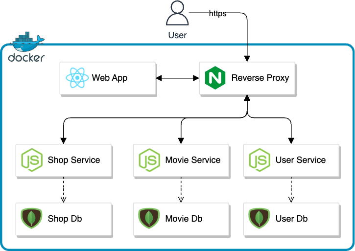

# Uniflix Express
Uniflix is a streaming platform that offers a wide range of local content, including movies and TV shows. Or at least it should be. Today it is simply a personal project created to practice technologies such as: React, Node.js, Mongo and Docker
## Architecture

<p align="center">
  
</p>

## Configuration
### Add environments

Create a file named `.env` in the root of the project and add the following environments:
```
SHOP_SERVICE_URI=https://my-website.com:3001/rest
MOVIE_SERVICE_URI=https://my-website.com:3002/rest
USER_SERVICE_URI=https://my-website.com:3003/rest
```

### Add SSL certifications
Add ssl certificates inside `/webapp` folder
```
📦 uniflix
└─ /webapp
   ├─ my-cert.cer
   └─ my-cert.key
```

### Deploy
Run wit docker-compose
```
docker-compose up --build
```
## Preview
<p align="center">
  
</p>

## Authors

- [@loreand95](https://www.github.com/loreand95)

